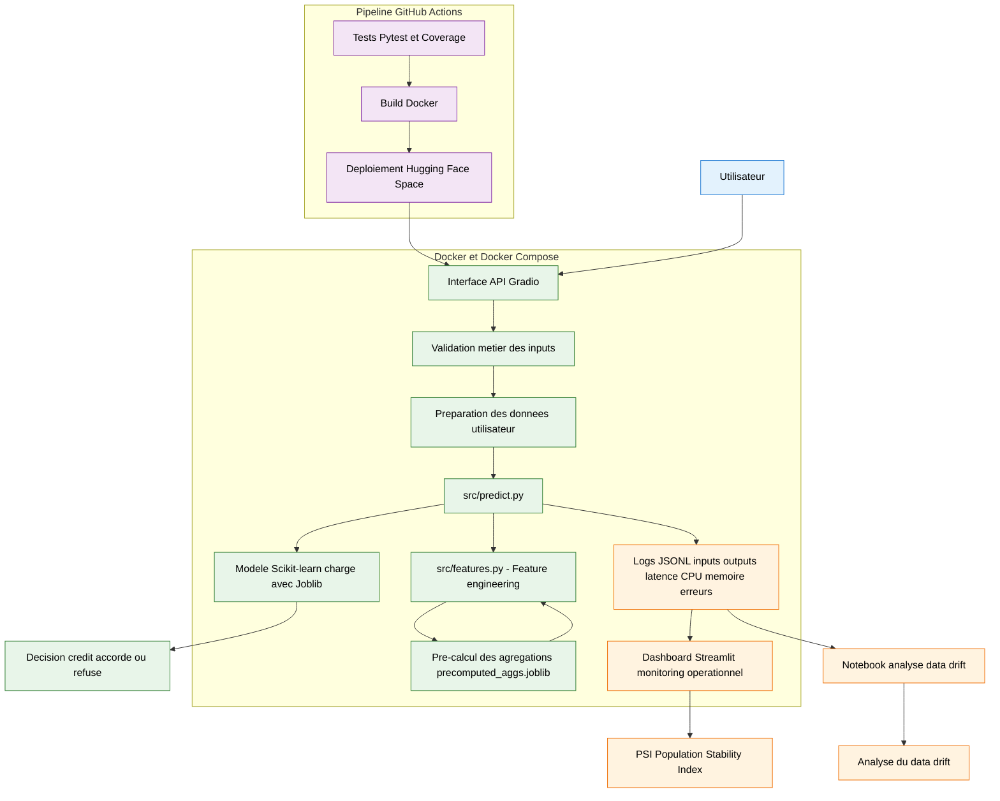

# Credit Scoring MLOps

## Description
Ce projet met en place un pipeline de credit scoring avec une approche MLOps complète :
- Feature engineering
- Entraînement et tracking des modèles avec MLflow
- API de prédiction avec Gradio
- Déploiement automatisé via CI/CD sur Hugging Face Spaces

---

## Structure du projet

```bash
├── data/
│   ├── raw/                         # Données récupérées depuis Hugging Face
│   └── processed/
│       └── precomputed_aggs.joblib
├── logs/
│   └── production_logs.jsonl        # Logs JSONL de production
├── mlruns/                          # Suivi des expérimentations MLflow
├── models/
│   └── credit_scoring_pipeline.joblib
├── notebooks/
│   ├── 01_credit_scoring_pipeline.ipynb
│   └── 02_monitoring_drift_analysis.ipynb
├── reports/
│   ├── baseline_metrics.json
│   ├── optimized_metrics_v1.json
│   ├── optimization_report.md
│   ├── profile_baseline.prof
│   └── profile_baseline.txt
├── src/
│   ├── __init__.py
│   ├── features.py
│   ├── precompute_features.py
│   └── predict.py
├── tests/
│   └── test_predict.py
├── app.py                           # Interface Gradio
├── streamlit_app.py                 # Dashboard Streamlit
├── Dockerfile
├── docker-compose.yml
├── requirements.txt
├── .gitignore
├── .dockerignore
└── README.md
```

---
## Architecture du projet 


## Données

Les données ne sont pas incluses dans ce dépôt.
Elles sont téléchargées dynamiquement depuis Hugging Face :
https://huggingface.co/datasets/Emilie7/credit-scoring-data

## API de prédiction 

L’application permet de prédire le risque de crédit à partir de variables utilisateur :
- âge
- revenu
- montant du crédit
- durée du prêt
- etc.

Le modèle est chargé une seule fois au démarrage pour optimiser les performances.

## CI/CD

Le pipeline GitHub Actions automatise :

- exécution des tests (pytest)
- build de l’image Docker
- déploiement automatique vers Hugging Face Space

Chaque git push sur la branche develop déclenche le pipeline.

## Lancer le projet

1. Créer un environnement :
```bash
conda create -n credit_scoring python=3.11
conda activate credit_scoring
```

2. Installer les dépendances 
```bash
pip install -r requirements.txt
```

3. Lancer l'application

```bash
python app.py
```

## Lancer les tests

```bash
PYTHONPATH=. pytest
```

## Analyse de couverture des tests

Le coverage des tests peut être exécuté avec :

```bash
PYTHONPATH=. pytest --cov=src
```

Les tests couvrent principalement le pipeline d'inférence et les cas critiques de prédiction dans `predict.py`(Taux de couverture de 88%).

## Benchmarks de performance

Benchmark baseline :

```bash
python benchmarks/benchmark_baseline.py
```

Benchmark optimisé :

```bash
python benchmarks/benchmark_optimized.py
```

## Technologies utilisées 

- Python
- Pandas
- NumPy
- Scikit-learn
- MLflow
- Gradio
- Docker
- GitHub Actions
- PyArrow

## Monitoring et optimisation

Le projet inclut un système de monitoring permettant de collecter :
- les temps d'inférence ;
- l'utilisation CPU ;
- l'utilisation mémoire ;
- les inputs / outputs des prédictions ;
- les erreurs d'exécution.

Les données sont stockées dans des logs JSON et visualisées avec un dashboard Streamlit.

Lancer le dashboard :

```bash
streamlit run streamlit_app.py
```

Une phase d'analyse de performance a été réalisée avec :
- benchmark de baseline ;
- profiling avec cProfile ;
- optimisation du preprocessing.

Le profiling a montré que le principal bottleneck provenait du recalcul des agrégations réalisées dans `build_features()` à chaque requête.

Une optimisation basée sur le pré-calcul des agrégations les plus coûteuses a ensuite été mise en place.

Les agrégations sont calculées une seule fois avec le script :

```bash
python src/precompute_features.py
```

Puis sauvegardées dans :

`data/processed/precomputed_aggs.joblib`

Lors de l'inférence, ces agrégations sont directement rechargées afin de limiter le coût du preprocessing tout en conservant la logique métier des prédictions.

Cette optimisation a permis de réduire la latence moyenne :
- de ~3 sec à ~0.108 sec ;
- et d'améliorer significativement le throughput du système.

Une métrique PSI (Population Stability Index) a également été intégrée au dashboard de monitoring afin de détecter automatiquement les écarts de distribution entre les données de référence et les données simulées en production.

Les valeurs PSI observées restent élevées en raison du faible volume de logs disponibles (~20 requêtes simulées), ce qui rend les distributions plus sensibles aux variations. Malgré cette limite, cette métrique permet de quantifier le data drift et complète l’analyse visuelle déjà présente dans le dashboard.

## Résultats de l'optimisation

| Métrique | Baseline | Optimized |
|---|---|---|
| Mean latency | 3.01 sec | 0.108 sec |
| Throughput | 0.33 req/sec | 9.28 req/sec |
| Memory usage | 2106 MB | 585 MB |
| Error rate | 0 % | 0 % |

## Limites et perspectives

Le projet repose sur un modèle tabulaire classique de credit scoring entraîné sur des données historiques simulées.

Certaines limites restent présentes :
- faible volume de logs de production pour l'analyse de drift ;
- absence de retraining automatique ;
- monitoring réalisé sur CPU uniquement ;
- absence de gestion avancée des versions de données.

Plusieurs améliorations pourraient être ajoutées :
- intégration d'un système de retraining automatisé ;
- déploiement cloud complet ;
- monitoring temps réel avec Prometheus/Grafana ;
- optimisation supplémentaire du pipeline d'inférence ;
- gestion plus avancée du drift et des alertes automatiques.